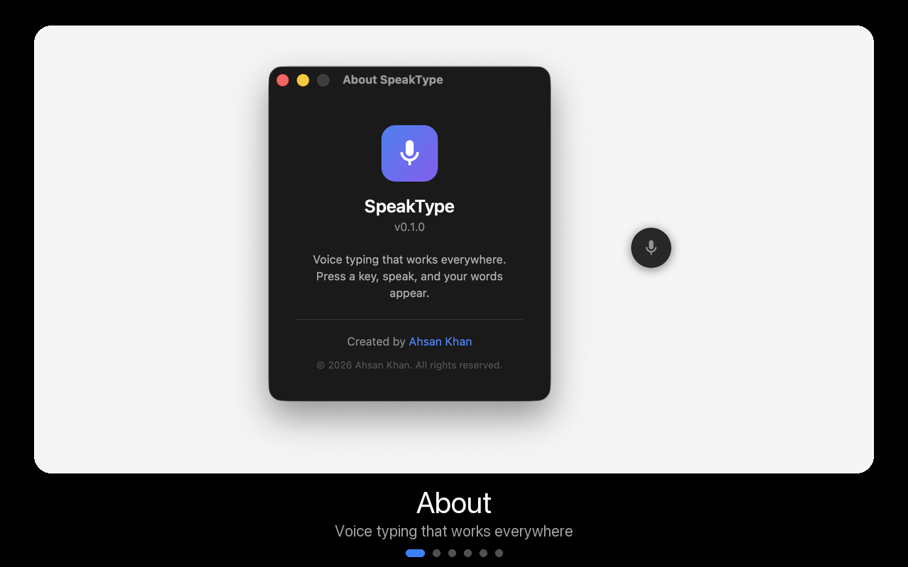

# SpeakType

**Push-to-talk voice typing that works everywhere.**

Press a hotkey, speak, press again — your words appear wherever you're typing. Local transcription on your machine. No cloud required.

<p align="center">
  
</p>

## Why SpeakType?

When you type, you self-edit and truncate. When you speak, you explain naturally and fully. SpeakType bridges that gap — talk to your terminal, your AI assistant, or any app, and have your words appear instantly.

- **Works everywhere** — terminals, IDEs, browsers, Slack, email
- **Private by default** — audio and transcription stay on your machine
- **Fast** — the desktop app keeps a Whisper model loaded for inference

## How it works

SpeakType has two parts:

1. **Client** — listens for your hotkey, records the microphone, pastes the result into the focused window
2. **Inference** — converts speech to text using OpenAI’s Whisper models, running locally

```
[F9] → Record → [F9] → Inference → Paste into focused window
```

The **desktop app** is a [Tauri](https://tauri.app/) native widget (floating UI, settings, tray). When you dictate, it sends audio to a bundled **whisper.cpp** sidecar on `http://127.0.0.1:8002/inference` — that sidecar runs the model, not the Tauri shell itself.

The optional **CLI** (`packages/cli/speaktype.py`) is a separate Python tool for terminal workflows. It can run **faster-whisper** in-process, or call an external API.

### Models

Download once, use offline. Pick a size in **Settings → Models** (app) or with `--model` (CLI).

| Model | Download | Speed | Accuracy | RAM |
|-------|----------|-------|----------|-----|
| tiny | ~75MB | Fastest | Basic | ~1GB |
| base | ~150MB | Fast | Good | ~1GB |
| small | ~500MB | Medium | Better | ~2GB |
| medium | ~1.5GB | Slow | Great | ~5GB |
| large-v3 | ~3GB | Slowest | Best | ~10GB |

**`base`** is the default sweet spot. Use **`small`** if you want better accuracy and have the RAM.

## Desktop app (recommended)

Built with **Tauri** — native macOS widget:

- Floating always-on-top widget with recording animation
- Settings — hotkey, server, models, history
- System tray integration
- Downloads `ggml` models and starts the whisper.cpp inference sidecar automatically

### Build from source

Requires Rust, Node, and Xcode command-line tools on macOS.

```bash
git clone https://github.com/ahsankhanamu/speaktype.git && cd speaktype
make install          # Python venv (optional CLI / Python server)
make dev              # Run Tauri app in dev mode
make build            # whisper.cpp sidecar + signed .dmg (see make/config.example)
```

For release builds, set `APPLE_DEVELOPER_ID` and `APPLE_TEAM_ID` (environment variables or a gitignored `make/local.mk`). See `make/config.example`. One-time notary setup: `make notary-setup`.

App source: `apps/widget-rust/`

Regenerate README media: `make assets`

## CLI (optional — developers & Linux)

Separate from the desktop app. Uses **faster-whisper** when run without `--api`:

```bash
git clone https://github.com/ahsankhanamu/speaktype.git && cd speaktype
python3 -m venv .venv && source .venv/bin/activate
pip install ".[all]"
```

### Linux dependencies

```bash
sudo apt install xdotool xclip portaudio19-dev   # Debian/Ubuntu
```

### macOS dependencies

```bash
brew install portaudio
```

Grant **Accessibility** permission to your terminal (System Settings → Privacy & Security → Accessibility).

### Run

```bash
python packages/cli/speaktype.py
```

1. Press **F9** (default) to start recording  
2. Speak  
3. Press **F9** again — text is pasted into the focused window  

```bash
python packages/cli/speaktype.py --model small
python packages/cli/speaktype.py --hotkey f8
python packages/cli/speaktype.py --language en
```

### External APIs (optional)

```bash
python packages/cli/speaktype.py --api https://api.groq.com/openai/v1/audio/transcriptions --api-model whisper-large-v3
```

## Advanced: Python server (CLI only)

If you use the CLI daily, you can keep `packages/server/whisper_server.py` running (**faster-whisper**, `POST /transcribe`). This is not used by the Tauri app.

```bash
# Terminal 1
python packages/server/whisper_server.py --model base

# Terminal 2
python packages/cli/speaktype.py --api http://localhost:8002/transcribe
```

| Component | UI | Inference engine | Endpoint |
|-----------|-----|------------------|----------|
| Desktop app | Tauri | whisper.cpp sidecar | `POST /inference` |
| CLI (default) | Python | faster-whisper | in-process |
| Python server + CLI | Python | faster-whisper | `POST /transcribe` |

## Troubleshooting

**No speech detected** — check the correct mic is selected; speak at normal volume; try a smaller model.

**Linux hotkey not working** — pynput needs X11. On Wayland, use an X11 session or `GDK_BACKEND=x11`.

**macOS permissions** — Accessibility for the terminal or SpeakType app.

**Slow inference** — use a smaller model, or use the desktop app so the sidecar keeps the model loaded.

## Contributing

Contributions welcome — voice activity detection, Wayland support, streaming transcription, and custom prompts are all good starting points.

## License

MIT — see [LICENSE](LICENSE).

## Acknowledgments

[Tauri](https://tauri.app/) · [whisper.cpp](https://github.com/ggerganov/whisper.cpp) (app inference sidecar) · [OpenAI Whisper](https://github.com/openai/whisper) (models) · [faster-whisper](https://github.com/SYSTRAN/faster-whisper) (optional CLI / Python server)
